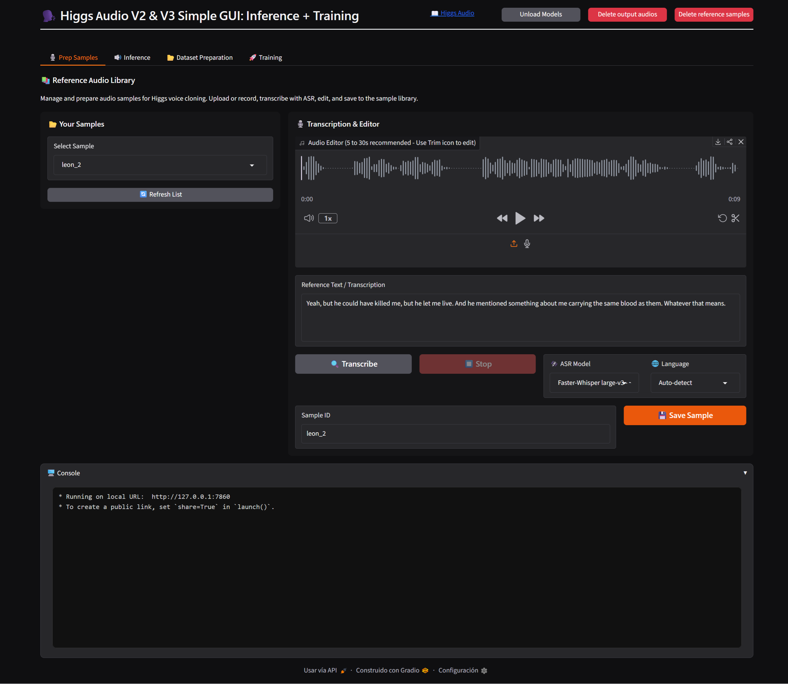
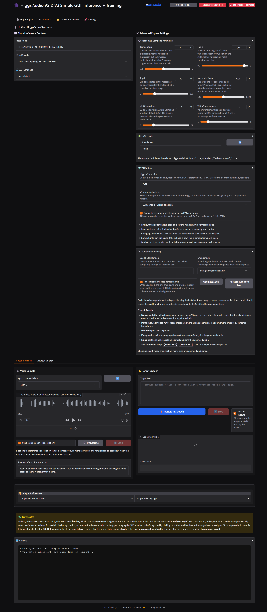
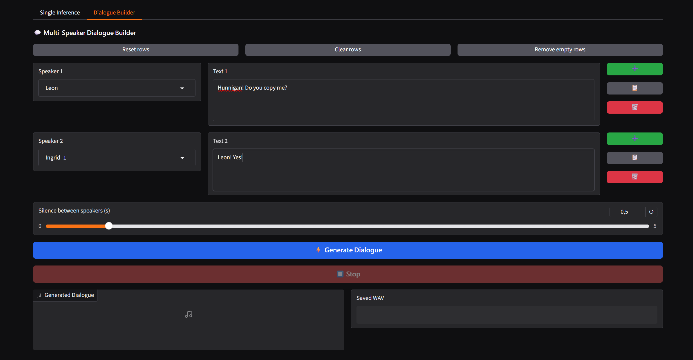
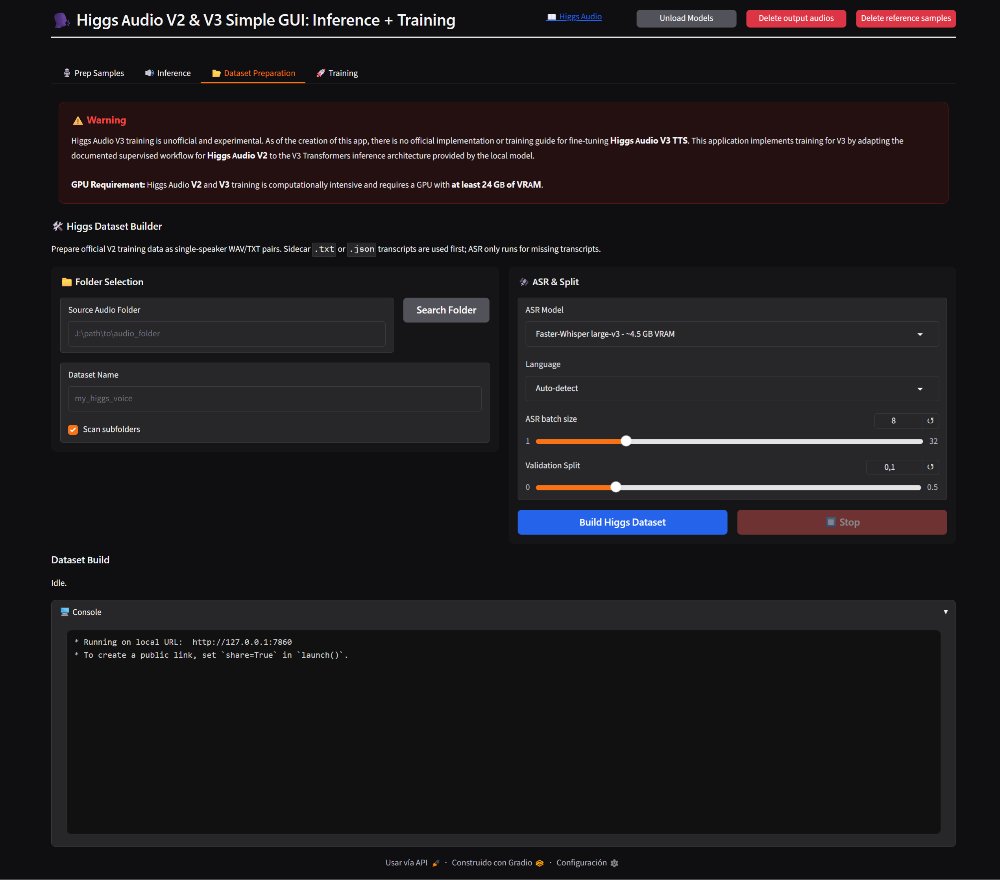
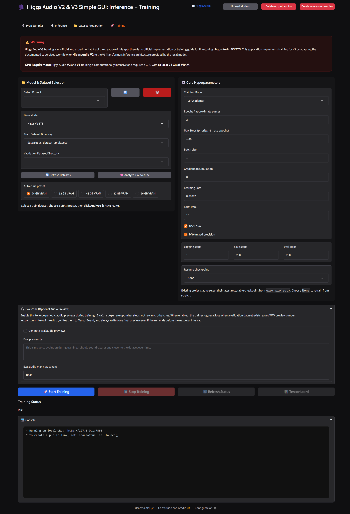

# 🗣️ Higgs Audio V2/V3 Simple GUI: Local TTS, Voice Cloning & LoRA Training

A polished Windows WebUI for **local Higgs Audio workflows**: reference voice preparation, Higgs V2/V3 speech generation, Faster-Whisper transcription, dataset building, and LoRA training.

---

## ✨ Feature Overview

| Area | What it does |
| :--- | :--- |
| **Higgs V3 TTS** | Local Transformers inference with modern Higgs V3 speech generation. |
| **Higgs V2 TTS** | Local Higgs V2 generation for legacy/experimental workflows. |
| **Reference Voice Library** | Save reusable voice samples and transcripts under `samples/`. |
| **LoRA Adapters** | Load V2/V3 adapters from `exp/` and switch them from the GUI. |
| **Single Inference** | Generate speech from target text with optional reference audio and seed control. |
| **Dialogue Builder** | Build multi-speaker turns, assign voice references, and concatenate the final WAV. |
| **Long-Form / Batch** | Split long text by paragraph, period, line, or speaker turns, then join chunks. |
| **Faster-Whisper ASR** | Transcribe reference samples or dataset audio locally. |
| **Dataset Preparation** | Convert curated audio folders into train/eval datasets under `data/`. |
| **Training UI** | Run single-speaker LoRA training for V2 and experimental V3 training. |
| **Local Storage Layout** | Models, cache, datasets, LoRAs, logs, samples, and outputs are organized by folder. |

---

## ⚠️ Higgs V3 Training Notice

**Higgs Audio V3 TTS training is experimental and unofficial.**

At the time this GUI was built, there is no official public Higgs V3 TTS fine-tuning guide or trainer equivalent to a mature supervised LoRA workflow. This app exposes an experimental V3 training path by adapting the available Higgs-style supervised workflow to the local V3 Transformers runtime.

---

## 🔄 Application Workflow

The GUI follows a complete local voice workflow:

### 1. 🎙️ Prep Samples



Build a reusable reference voice library.

- Import or record short reference clips.
- Trim samples to a clean, stable range.
- Transcribe with Faster-Whisper or write transcripts manually.
- Save paired audio/transcript samples to `samples/`.

Recommended reference clips are usually **5–30 seconds**, clean, single-speaker, and free of background music or overlapping voices.

---

### 2. 🗣️ Inference



Generate speech with Higgs V2 or V3.

- Select the TTS model.
- Optionally load a LoRA adapter.
- Select a saved voice sample or upload reference audio.
- Tune the desired parameters under advanced settings.
- Save generated WAV files under `outputs/`.

Long text should use chunking. Every chunk is a separate synthesis pass, so slight voice/prosody variation can happen between chunks.

---

### 3. 👥 Dialogue / Multi-Speaker



Create multi-turn generated conversations.

- Add, copy, or delete speaker rows.
- Assign a different voice sample per turn.
- Generate each turn independently.
- Join the final dialogue with configurable silence gaps.

This is useful for podcasts, demos, character testing, and comparing voice references.

---

### 4. 📚 Dataset Preparation



Prepare train/eval datasets from local audio folders.

- Supports common audio formats.
- Uses existing `.txt` or `.json` transcripts when available.
- Fills missing transcripts with Faster-Whisper.
- Writes prepared train/eval data under `data/`.
- Validates dataset structure before training.

---

### 5. 🧬 Training / LoRA



Train or resume LoRA projects.

- Select a training project.
- Choose V2 or experimental V3.
- Configure batch size, gradient accumulation, learning rate, LoRA rank, bf16, logging, save, and eval intervals.
- Resume from discovered checkpoints.
- Store outputs, adapters, checkpoints, and eval audio under `exp/`.

---

## 🛠️ Installation & Launch

This project uses `uv` for fast and reproducible dependency management.

### Install

Run from the project folder:

```bat
install.bat
```

The installer will:

1. Install `uv` if needed.
2. Create the local virtual environment.
3. Install non-Torch dependencies.
4. Install the selected PyTorch backend last.
5. Verify CUDA when a CUDA backend is selected.

### PyTorch Backend Options

| Option | Target |
| :--- | :--- |
| **Auto-detect NVIDIA / CPU** | Recommended first try. |
| **CUDA 11.8** | NVIDIA GTX 10xx / Pascal compatibility. |
| **CUDA 12.6** | NVIDIA RTX 20xx / 30xx. |
| **CUDA 12.8** | NVIDIA RTX 40xx / 50xx. |
| **CPU only** | Compatibility mode; slow for TTS/training. |
| **AMD DirectML** | Experimental Windows AMD path. |

### Launch

```bat
start.bat
```

Then open:

```text
http://127.0.0.1:7860
```

---

## ⚙️ Requirements & Hardware Guide

### Software

- Windows 10/11.
- Modern web browser.
- `uv` package manager.
- NVIDIA driver compatible with the selected CUDA backend.

### VRAM Estimates

| Task | Minimum | Recommended |
| :--- | :---: | :---: |
| **Faster-Whisper ASR** | CPU or small GPU | 8 GB+ VRAM for large-v3 |
| **Higgs V2 inference** | 12 GB VRAM | 16 GB+ VRAM |
| **Higgs V3 inference** | 16 GB VRAM | 24 GB+ VRAM |
| **LoRA training** | 24 GB VRAM | 24 GB+ VRAM |

CPU mode is available for compatibility, but TTS inference and training are expected to be slow.

---

## 📁 Local Folder Layout

| Folder | Purpose |
| :--- | :--- |
| `models/` | Final downloaded model folders. |
| `models/.cache/` | `uv`, Hugging Face, Xet, Torch, temp, and runtime caches. |
| `samples/` | Reference voice samples and transcripts. |
| `outputs/` | Persisted generated WAV files. |
| `data/` | Prepared training datasets. |
| `exp/` | Training projects, LoRA adapters, checkpoints, and eval audio. |
| `logs/` | App and training logs. |
| `config/` | Local UI settings. |

---

## 🎧 Supported Formats

### Audio

```text
.wav
.mp3
.flac
.ogg
.m4a
```

### Transcripts

```text
.txt
.json
```

For reference samples, use the same file stem:

```text
my_voice.wav
my_voice.txt
```

---

## 🧪 Runtime Notes

### Higgs V3 Generation

- V3 can stop a generation around its internal end signal even when `max_new_tokens` is high.
- Use chunking for long text.
- Lower temperature and top-p values usually improve stability.
- Fixed seeds help compare settings; random seeds can improve natural variation.

### RAS / Repetition-Aware Sampling (Higgs V2 only)

RAS helps reduce audio-token loops, repeated syllables, repeated silences, or stuck generation patterns.

Typical starting point:

```text
ras_win_len = 7
ras_win_max_num_repeat = 2
```

If generation loops, try lowering the repeat count. If speech becomes too clipped or unnatural, return to the default.

### Torch Compile

Torch compile is optional and can increase the synthesis speed by up to 2.3x (Nvidia GPU only)

- First generation can be slower (take several minutes) because kernels need warmup.
- Similar later generations can be significantly faster.
- Changing model, shape, reference pattern, LoRA adapter, or chunk layout can trigger new compile passes.
- Disable it if you prefer predictable speed over maximum throughput.

---

## 📊 RTX 3090 Compile Benchmark

GUI Higgs V3 test on **NVIDIA GeForce RTX 3090**, same text, seed, and frame limit.

```text
Max audio frames: 4096
Precision: auto -> bf16
Attention: SDPA
LoRA: none
Reference audio: none
```

| Mode | Load time | Frames | Audio length | Generation elapsed | RTF | Avg frames/s |
| :--- | ---: | ---: | ---: | ---: | ---: | ---: |
| `torch.compile` off | 8.37s | 525 | 20.7s | 21s | 1.01 | 24.95 |
| `torch.compile` on | 8.32s | 551 | 21.8s | 9s | 0.41 | 57.98 |

In this run, `torch.compile` was about **2.3× faster** during frame generation once active. First-time compilation can still take several minutes to warmup.

---

## 🧯 Troubleshooting

| Symptom | Suggested action |
| :--- | :--- |
| CUDA OOM during inference | Lower max frames, unload ASR, disable compile, use chunking, or try lower precision if supported. |
| Voice changes between chunks | Enable shared chunk seed, use shorter chunks, or reuse the same reference sample consistently. |
| Output stops early | Use chunking; V3 may stop at its internal end signal. |
| First compile run seems frozen | Wait for kernel compilation; later runs with similar shapes should be faster. |
| ASR is slow | Use a smaller Faster-Whisper model or CPU-friendly settings. |
| Training overfits quickly | Lower learning rate, reduce max steps, increase eval frequency, and use cleaner/more varied data. |

---

## 🙏 Credits

Built for local use around:

- [Boson AI Higgs Audio](https://github.com/boson-ai/higgs-audio)
- [Train Higgs Audio repo](https://github.com/JimmyMa99/train-higgs-audio)
- [Faster-Whisper / CTranslate2](https://github.com/SYSTRAN/faster-whisper)

GUI layout and workflow inspired by [FranckyB](https://github.com/FranckyB) [Voice Clone Studio](https://github.com/FranckyB/Voice-Clone-Studio)

---

## 📌 Project Scope

This GUI is a practical local workflow tool, not an official Boson AI release. Higgs model licenses and usage restrictions still apply. Review the upstream model licenses before distributing generated audio, fine-tunes, or derived model artifacts.
